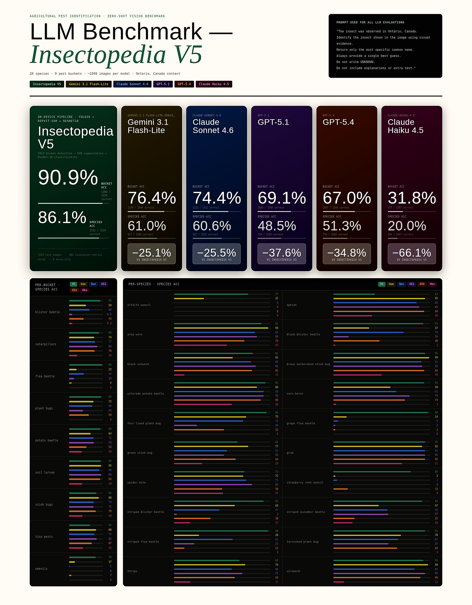

# Insectopedia Dataset

Annotated insect pest image dataset for training and evaluating the Insectopedia agricultural pest identification system. Species are scoped to Ontario crop systems.

This repository contains the dataset structure, annotation files, and benchmark results. The training pipeline and mobile app are maintained in separate repositories.

---

## Contents

- [Dataset Statistics](#dataset-statistics)
- [Repository Structure](#repository-structure)
- [YOLO Detection Buckets](#yolo-detection-buckets)
- [Species Classes](#species-classes)
- [Annotation Format](#annotation-format)
- [System Overview](#system-overview)
- [Benchmark](#benchmark)
- [Data Sources](#data-sources)
- [Related Components](#related-components)
- [License](#license)

---

## Dataset Statistics

| Split | Images |
|---|---|
| Training | 7,779 |
| Validation | 1,941 |
| Held-out test suite | 1,524 |
| **Total** | **11,244** |

- 20 species · 9 detection buckets
- 5,000+ manually annotated bounding boxes
- 12,000+ classification crops generated via segmentation

---

## Repository Structure

```
Insectopedia-Dataset/
│
├── classification/
│   ├── images/
│   └── labels/
│
├── YOLO/
│   ├── train/
│   └── valid/
│
├── test_suite/
│   ├── images/
│   └── labels/
│
├── benchmark/
│
└── README.md
```

**classification** — Species-level crops used to train classification models (ResNet-18).

**YOLO** — Detection dataset used to train the coarse bucket detector.

**test_suite** — Held-out dataset used for end-to-end pipeline evaluation.

**benchmark** — Evaluation results and visual summaries.

---

## YOLO Detection Buckets

The detection model predicts one of 9 coarse groups. Each group is then routed to a species-level classifier.

```
0: tiny_pests       → aphids, thrips, spider_mite
1: flea_beetle      → flea_beetle, grape_flea_beetle, striped_flea_beetle
2: caterpillars     → army_worm, black_cutworm, corn_borer
3: plant_bugs       → miridae, tarnished_plant_bug, four_lined_plant_bug
4: soil_larvae      → grub, wireworm
5: weevils          → alfalfa_weevil, strawberry_root_weevil
6: stink_bugs       → green_stink_bug, brown_marmorated_stink_bug
7: blister_beetle   → blister_beetle, black_blister_beetle, striped_blister_beetle
8: potato_beetle    → colorado_potato_beetle, striped_cucumber_beetle
```

---

## Species Classes

The dataset covers 20 species classes used for classification.

```
 0: alfalfa_weevil
 1: aphids
 2: army_worm
 3: black_cutworm
 4: corn_borer
 5: strawberry_root_weevil
 6: grub
 7: spider_mite
 8: tarnished_plant_bug
 9: thrips
10: wireworm
11: four_lined_plant_bug
12: grape_flea_beetle
13: black_blister_beetle
14: brown_marmorated_stink_bug
15: colorado_potato_beetle
16: green_stink_bug
17: striped_blister_beetle
18: striped_flea_beetle
19: striped_cucumber_beetle
```

---

## Annotation Format

Annotations follow YOLO format:

```
<class_id> <x_center> <y_center> <width> <height>
```

Coordinates are normalized to [0, 1]. Each image has a corresponding `.txt` annotation file. Class IDs correspond to the bucket mapping above.

---

## System Overview

Insectopedia runs a three-stage on-device pipeline:

```
Image → YOLO Detection → RepViT-SAM Segmentation → ResNet-18 Classification
```

The full pipeline runs on-device (Android) without a network call. This dataset supports training and evaluation of all three stages.

---

## Benchmark

The benchmark compares the Insectopedia V5 on-device pipeline against five general-purpose multimodal LLMs on the 1,524-image held-out test suite. All LLMs were evaluated zero-shot with a fixed prompt; no fine-tuning was applied.



| Model | Bucket Acc | Species Acc | Δ vs V5 |
|---|---|---|---|
| **Insectopedia V5** | **90.9%** | **86.1%** | — |
| Gemini 3.1 Flash-Lite | 76.4% | 61.0% | −25.1 pp |
| Claude Sonnet 4.6 | 74.4% | 60.6% | −25.5 pp |
| GPT-5.1 | 69.1% | 48.5% | −37.6 pp |
| GPT-5.4 | 67.0% | 51.3% | −34.8 pp |
| Claude Haiku 4.5 | 31.8% | 20.0% | −66.1 pp |

Prompt used for all LLM evaluations:

```
"The insect was observed in Ontario, Canada.
Identify the insect shown in the image using visual evidence.
Return only the most specific common name.
Always provide a single best guess.
Do not write UNKNOWN.
Do not include explanations or extra text."
```

---

## Data Sources

Images were curated from two publicly available sources and manually reviewed to remove unsuitable observations.

**iNaturalist** — https://www.inaturalist.org/

**IP102 Dataset** — https://drive.google.com/drive/folders/1svFSy2Da3cVMvekBwe13mzyx38XZ9xWo

> Xiaoping Wu, Chi Zhan, Yukun Lai, Ming-Ming Cheng, and Jufeng Yang. *IP102: A Large-Scale Benchmark Dataset for Insect Pest Recognition.* IEEE CVPR, pp. 8787–8796, 2019.

---

## Related Components

| Component | Description |
|---|---|
| **Insectopedia Dataset** (this repo) | Annotated image dataset for training and evaluation |
| **Insectopedia Pipeline** | ML training and inference pipeline (YOLO + SAM + ResNet-18) |
| **Insectopedia App** | Flutter mobile app with on-device inference and HITL correction workflow |

---

## License

Images originate from public datasets and observation platforms. Users should respect the licensing terms of the original sources.

Dataset curated and annotated as part of a computer vision capstone project at the University of Windsor (2026).
